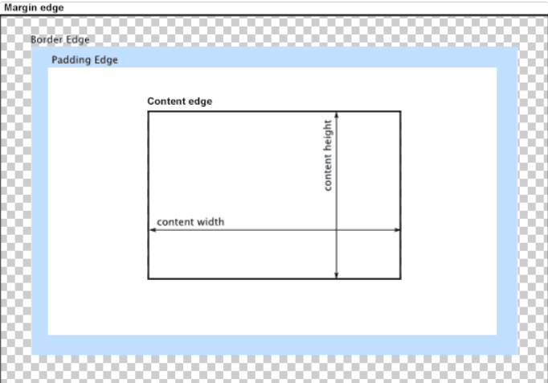

# What is CSS?
CSS stands for Cascading Style Sheets. It is the language for describing the presentation of Web pages, including colours, layout, and fonts, thus making our web pages presentable to the users.

#  CSS History
- 1994: First Proposed by Hakon Wium Lie on 10th October
- 1996: CSS was published on 17th November with influencer Bert Bos.
- 1996: CSS became official with CSS was published in December
- 1997: Created CSS level 2 on 4th November 
- 1998: Published on 12th May

#  CSS Syntax
```
Selector {
    Property 1 : value;
    Property 2 : value;
    Property 3 : value;
}
```
For example:
```
h1 {
    color: red;
    text-align: center;
}
#unique {
    color: green;
}
```

- Selector: selects the element you want to target.
- Always remains the same whether we apply internal or external styling .
- There are few basic selectors like tags, id’s, and classes.
- All forms this key-value pair.
- Keys: properties(attributes) like color, font-size, background, width, height, etc.
- Value: values associated with these properties.

# CSS Comment
- Comments don’t render on the browser.
- Helps to understand our code better and makes it readable.
- Helps to debug our code.
- Two ways to comment:
1. Single line 
```
 /*<p> This is a paragraph tag. </p>*/
```
2. Multiple lines
```
/*
h1 {
    color: red;
    text-align: center;
} 
*/
```

# Types of CSS
There are 3 ways to write CSS in our HTML file.
1. Inline CSS
2. Internal CSS
3. External CSS

Priority order:

**Inline > Internal > External**

## Inline CSS
- Before CSS this was the only way to apply styles.
- Not an efficient way to write as it has a lot of redundancy.
- Uniquely applied on each element.
- Example:
```
<h3 style="color: red”> Have a great day </h3>
```

## Internal CSS
- With the help of style tag, we can apply styles within the HTML file.
- Redundancy is removed.
- Uniquely applied on a single document.
- Example:
```
< style>
    h1 {
        color: red;
    }
</style>  
```

## External CSS
- With the help of `<link>` tag in the head tag, we can apply styles.
- File saved with .css extension.
- Redundancy is removed.
- Example:
```
<head>
    <link rel="stylesheet" type="text/css" href="styles.css">
</head>
```

# CSS Selectors
The selector is used to target elements and apply CSS.

Three simple selectors:
1. Element Selector 
2. Id Selector
3. Class Selector

Priority of Selectors:

**Id > Class > Element**

## Element Selector
- Used to select HTML elements by its name.
- Example:
```
h1 {                    //We selected the heading tag and then changed the 
    color: red;         //color property i.e text color to red.
}
```

## ID Selector
- The id attribute is used to select HTML element.
- Used to target specific or unique element.
- Example:
```
#unique {               //We selected the id and then changed the 
    color: red;         //color property i.e text color to red.
}
```

## Class Selector
- The class attribute is used to select HTML element.
- Used to target a specific class of the element.
- Example:
```
.box {                  //We selected the class and then changed the
    color: red;         //color property i.e text color to red.
}
```

# CSS Colors
- There are different colouring schemes in CSS.
- Three widely used techniques are as follows:

1. **RGB**
    - This starts with RGB and takes 3 parameter.
    - 3 parameter basically corresponds to red, green and blue.
    - The value of each parameter may vary from 0 to 255.
    - Eg: RGB(255,0,0); means color red.

2. **HEX**
    - Hex code starts with # and comprises of 6 numbers which are further - divided into 3 sets.
    - Sets basically correspond to Red, Green, and Blue.
    - Single set value can vary from 00 to 09 and AA to FF.
    - Eg: #ff0000 ; means color red.

3. **RGBA**
    - This starts with RGB and takes 4 parameter.
    - 4 parameter basically corresponds to red, green, blue and alpha.
    - Value of the first three parameters may vary from 0 to 255 and the last parameter ranges from 0 to 1.
    - Eg: RGB(255,0,0,0); means color red.

# CSS BoxModel
- Every element in CSS can be represented using the BOX model.
- It allows us to add a border and define space between the content.
- It helps the developer to develop and manipulate the elements.
- It consists of 4 edges:
    1. Content edge - It comprises of the actual content.
    2. Padding edge - It lies in between content and border edge.
    3. Border edge - Padding is followed by the border edge.
    4. Margin edge - It is an outside border and controls the margin of the element.

