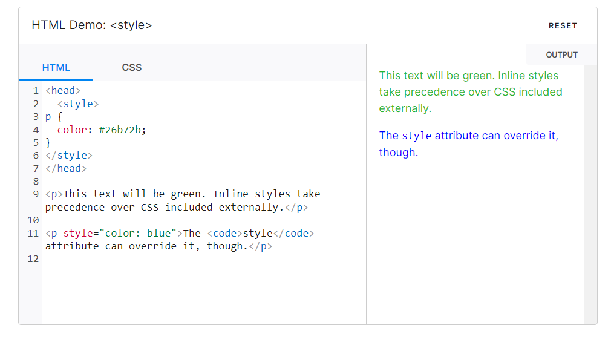

# HTML 

HTML - *H*yper *T*ext *M*arkup *L*anguage

This is a language written for writing web pages. It uses tags to define structure which further have attributes which we will discuss in detail

## WHERE TO WRITE ?
 
 There are various editors available

    * Sublime Text
    * Notepad
    * VS CODE

:exclamation: Do not use MS WORD for the same

## HTML Tags and Attributes

Tags are used to mark up the start of an HTML element and they are usually enclosed in angle brackets (<>)

eg: 

here title tag is opened and closed and text to be printed is written between them.

Attributes contain additional pieces of information. Attributes take the form of an opening tag and additional info is placed inside.

eg : 

here the img tag has attributes like height

so we can understand 

*TAGS* ==> _SKELATON/BODY_
*ATTRBUTES* ==> _FEATURE/CHARACTERISTICS_


## Some rules to keep in mind

1. A tag is opened < tag_name > like this and closed using a forwardslash symobl (*/*) like < /tag_name >.
2. A tag opened must be closed unless not required . eg: we saw that title tag must be closed but img tag doesn't require a closing tag.
3. Wrap and indent the tags properly. The tag that open first closes last. Follwing is an example of a mistake.


:exclamation: In this HTML tag cannot close before head tag closes as HTML tag opens before haed tag

## Basic HTML Structure

A basic HTML file looks like this


Line 1: All HTML documents must start with a <!DOCTYPE> declaration.
The declaration is not an HTML tag. It is an "information" to the browser about what document type to expect.
Line 2 AND 10: Opening and Closing HTML tag respectively (marking start and end of html doc)
Line 3 AND 6:  Opening and Closing head tag respectively (marking start and end of head of file , defining title)
Line 4: Defining title tag , which contains name of the webpage
Line 7 AND 9:  Opening and Closing body tag respectively (marking start and end of the body of web page)
Line 8: We can add more tags and ther information to be discplayed.

## Some Important Tags 

1. To set text in *boldface* we use bold tag : < b > This is bold text < /b >
2. To set text in _italicface_ we use italic tag : < i > This is italic text < /i >
3. To write a paragraph we use paragraph tag : < p > write your para < /p >


4. Headings have differnent tags depending upon the size 


5. To aligh the text to the center of the page horizontally : < center > center aligned text < /center >
6. To insert a line break < br > tag is used , it inserts a horizontal line
7. To insert images , < img > tag is used along with attributes discussed further
8. To insert links we use < a > .... < /a> tag , the attributes used are shared ahead.

## Some Important Attributes

1. For img tag:
    src: to specify the path of file location
    alt: the name to be displayed in alternative
    width: to specify the width of the image (in pixels)
    height: to specify the height of the image (in pixels)


2. For hyperlink tag:
    href : to specify the link 


3. For body tag:
    background:It determines the background image for the document.
    bgcolor:It determines the background color of the content.
    text : It determines the text


## Creating a webpage using what we have learnt so far


## Styling your Page Elements

You can easily style elements using the ``<style>`` tag. It contains CSS properties. You can check out CSS Documentation [here](https://github.com/WeBeginners-Community/DocBook/tree/master/CSS)


This can be placed in the ``head`` of the HTML DOM or ine individual element.



## Organise Data in Tables

You can create tables with the help of ``<table> </table>`` tags
It creates grid structure with rows and columns and can be customised.
### Tags
1. ``<table> </table>`` - The Table is enclosed in these two tags.
2. ``<tr> </tr>`` - This tag is the start/end of the Table Row.
3. ``<th> </th>`` - This tag is the start/end of the Table Column
4. ``<td> </td>`` - This represents a Table Cell.

Here's an example-
````
<table>
  <tr>
  <th>Person</th>
    <th>Person 1</th>
    <th>Person 2</th>
    <th>Person 3</th>
  </tr>
  <tr>
  <th>Name</th>
    <td>Emil</td>
    <td>Tobias</td>
    <td>Linus</td>
  </tr>
  <tr>
  <th>Age</th>
    <td>16</td>
    <td>14</td>
    <td>10</td>
  </tr>
</table>
````
It'll look like this-

**Person** | Person 1 | Person 2 |	Person 3 |
|--|--|--|--|
**Name** |	Emil	| Tobias |	Linus | 
**Age** | 16|	14 | 10

## Lists
It is a set of items grouped together. Each list item is enclosed in ``<li>`` tag. It is of two types-

    Unordered List
    Ordered List

### Unordered List
These are enclosed in ``<ul>`` tags.
````
<ul>
    <li>Beetroot</li>
    <li>Ginger</li>
    <li>Potato</li>
        <li>Radish</li>
/ul>
````
It'll look like this by default
<ul>
         <li>Beetroot</li>
         <li>Ginger</li>
         <li>Potato</li>
         <li>Radish</li>
</ul>

####  Type Attribute
The Type attribute can be used to specify the style of bullet in the list. Here are the Options-

    <ul type = "square"> -   Square Shape
    <ul type = "disc">   -   Normal Bullet 
    <ul type = "circle"> -   Outlined Bullet

This is how they look-
<ul type="square"><li>Square</li></ul>
<ul type="disc"><li>Disc</li></ul>
<ul type="circle"><li>Circle</li></ul>

## Ordered List
These are enclosed in ``<ol>`` tags.
````
<ol>
    <li>Beetroot</li>
    <li>Ginger</li>
    <li>Potato</li>
    <li>Radish</li>
/ol>
````
It'll look like this by default
<ol>
         <li>Beetroot</li>
         <li>Ginger</li>
         <li>Potato</li>
         <li>Radish</li>
</ol>

####  Type Attribute
The Type attribute can be used to specify the style of numbering in the list. Here are the Options-

    <ol type = "1"> - Default-Case Numerals.
    <ol type = "I"> - Upper-Case Numerals.
    <ol type = "i"> - Lower-Case Numerals.
    <ol type = "A"> - Upper-Case Letters.
    <ol type = "a"> - Lower-Case Letters.

This is how they look-
<ol type = "1"><li>Numbered</li></ol>
<ol type = "I"><li>Uppercase Roman Numerals</li></ol>
<ol type = "i"><li>Lowercase Roman Numerals</li></ol>
<ol type = "A"><li>Uppercase Letters</li></ol>
<ol type = "a"><li>Lowercase Letters</li></ol>

## Div
In an HTML document, the ``<div>`` tag designates a division or section.
The HTML "div" tag is used to group HTML elements, which are subsequently given a container and given a CSS or JavaScript style.
The ``class`` or ``id`` attribute makes it simple to decorate the div tag.

The div tag is a block-level element, which means that it will start on a new line and take up the full width available.

For Example
````
<div style=”color:#0000FF”>

<h3>This heading is set to blue in the div element.</h3>

<p>This text is also set to blue.</p>

</div>
````
It'll look like this-
<div style="color:#0000FF">
<h3>This heading is set to blue in the div element.</h3>
<p>This text is also set to blue.</p>
</div>

## Span
The HTML ``<span>`` tag is used to group inline-elements in a document. The ``<span>`` tag provides no visual change by itself.
The ``class`` or ``id`` attribute of the ``<span>`` tag allows for simple styling using CSS or manipulation with JavaScript.

The ``<div>`` element and the ``<span>`` tag are quite similar, however div is a block-level element and span is an inline element.

For Example
````
<p>My mother has <span style="color:blue">blue</span> eyes.</p>
````
It'll look like this-
<p>My mother has <span style="color:blue">blue</span> eyes.</p>


