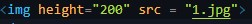
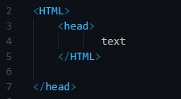
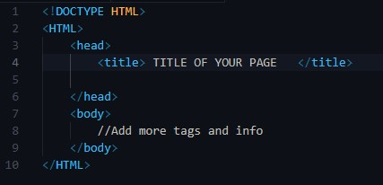
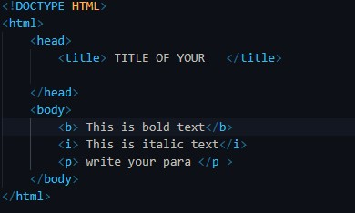
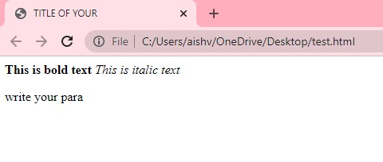
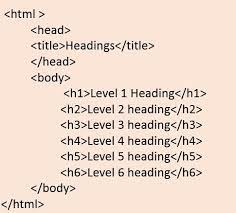
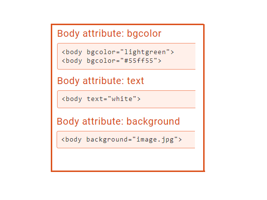
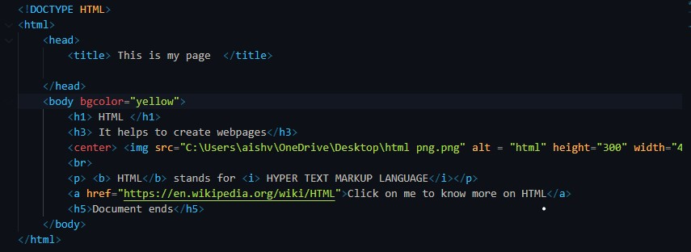
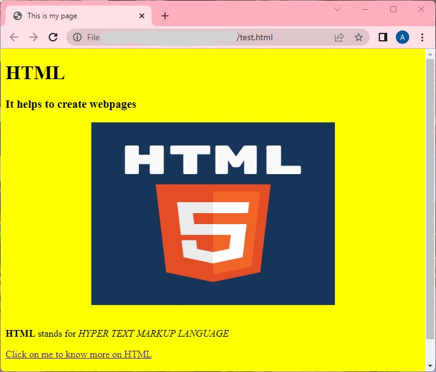

# HTML 

HTML - *H*yper *T*ext *M*arkup *L*anguage

This is a language written for writing web pages. It uses tags to define structure which further have attributes which we will discuss in detail

## WHERE TO WRITE ?
 
 There are various editors available
    * Sublime Text
    * Notepad
    * VS CODE

:exclamation: Do not use MS WORD for the same

## HTML Tags and Attributes

Tags are used to mark up the start of an HTML element and they are usually enclosed in angle brackets (<>)

eg: 

here title tag is opened and closed and text to be printed is written between them.

Attributes contain additional pieces of information. Attributes take the form of an opening tag and additional info is placed inside.

eg : 

here the img tag has attributes like height

so we can understand 

*TAGS* ==> _SKELATON/BODY_
*ATTRBUTES* ==> _FEATURE/CHARACTERISTICS_

## Some rules to keep in mind

1. A tag is opened < tag_name > like this and closed using a forwardslash symobl (*/*) like < /tag_name >.
2. A tag opened must be closed unless not required . eg: we saw that title tag must be closed but img tag doesn't require a closing tag.
3. Wrap and indent the tags properly. The tag that open first closes last. Follwing is an example of a mistake.

:exclamation: In this HTML tag cannot close before head tag closes as HTML tag opens before haed tag

## Basic HTML Structure

A basic HTML file looks like this

Line 1: All HTML documents must start with a <!DOCTYPE> declaration.
The declaration is not an HTML tag. It is an "information" to the browser about what document type to expect.
Line 2 AND 10: Opening and Closing HTML tag respectively (marking start and end of html doc)
Line 3 AND 6:  Opening and Closing head tag respectively (marking start and end of head of file , defining title)
Line 4: Defining title tag , which contains name of the webpage
Line 7 AND 9:  Opening and Closing body tag respectively (marking start and end of the body of web page)
Line 8: We can add more tags and ther information to be discplayed.

## Some Important Tags 

1. To set text in *boldface* we use bold tag : < b > This is bold text < /b >
2. To set text in _italicface_ we use italic tag : < i > This is italic text < /i >
3. To write a paragraph we use paragraph tag : < p > write your para < /p >

4. Headings have differnent tags depending upon the size 

5. To aligh the text to the center of the page horizontally : < center > center aligned text < /center >
6. To insert a line break < br > tag is used , it inserts a horizontal line
7. To insert images , < img > tag is used along with attributes discussed further
8. To insert links we use < a > .... < /a> tag , the attributes used are shared ahead.

## Some Important Attributes

1. For img tag:
    src: to specify the path of file location
    alt: the name to be displayed in alternative
    width: to specify the width of the image (in pixels)
    height: to specify the height of the image (in pixels)

2. For hyperlink tag:
    href : to specify the link 

3. For body tag:
    background:It determines the background image for the document.
    bgcolor:It determines the background color of the content.
    text : It determines the text

## Creating a webpage using what we have learnt so far

 

