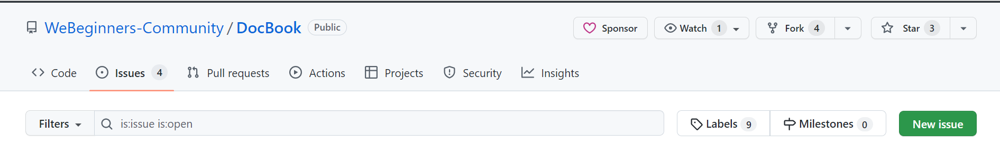
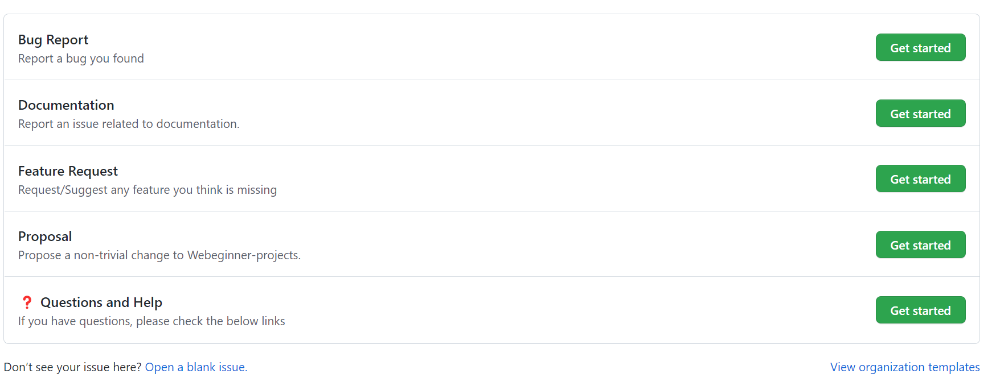
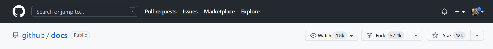
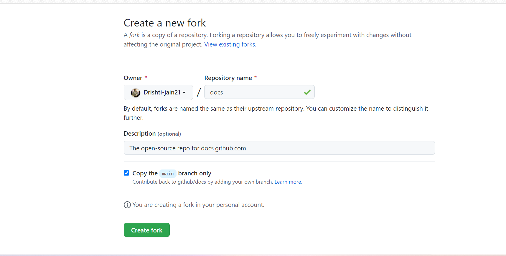
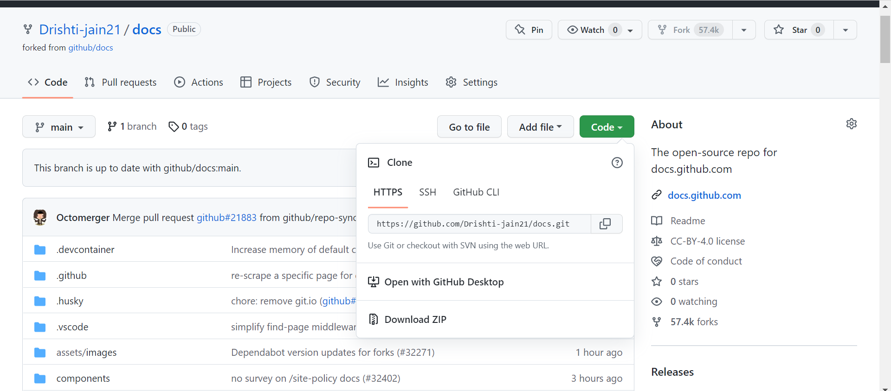
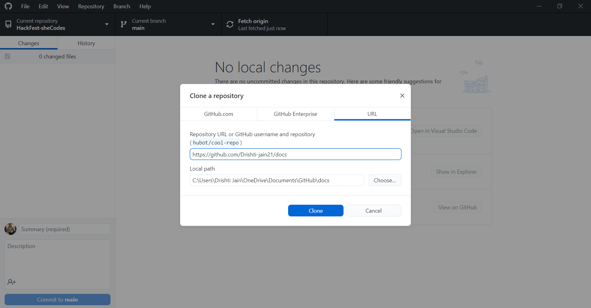
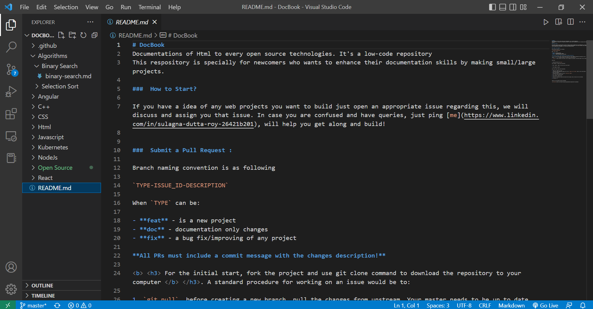
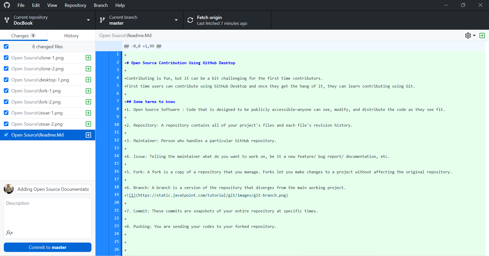
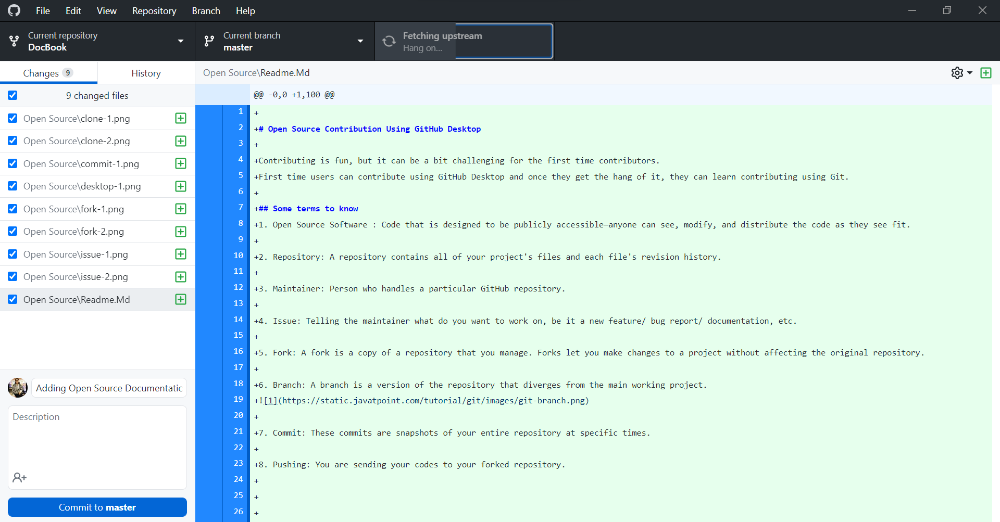

# Open Source Contribution Using GitHub Desktop

Contributing is fun, but it can be a bit challenging for the first time contributors.
First time users can contribute using GitHub Desktop and once they get the hang of it, they can learn contributing using Git. 

## Some terms to know
1. Open Source Software : Code that is designed to be publicly accessible—anyone can see, modify, and distribute the code as they see fit.

2. Repository: A repository contains all of your project's files and each file's revision history.

3. Maintainer: Person who handles a particular GitHub repository.

4. Issue: Telling the maintainer what do you want to work on, be it a new feature/ bug report/ documentation, etc.

5. Fork: A fork is a copy of a repository that you manage. Forks let you make changes to a project without affecting the original repository.

6. Branch: A branch is a version of the repository that diverges from the main working project.

7. Commit: These commits are snapshots of your entire repository at specific times.

8. Pushing: You are sending your codes to your forked repository.

9. Fetching/Pulling: You will pull or fetch all the files to make sure all the files are present.

## Steps to contribute
1. Open an issue:
    Creating an issue is really important as it makes sure the maintainer knows what changes you want to make and can approve or disapprove if they want that change or not.

    For creating a new issue 👇
     

    Select whatever issue fits the changes you want to make.
    

    Then Get Started!

Once the issue is assigned to you, you can start working on it.

2. Create a fork of the repository:
    Creating a fork is important as you will have to make changes and test them before directing those changes to the main repository for everyone to see which will be done on your forked repository.

    For forking a repository, go here 👇
    

    It will then show this page, through which you can create a fork.
    

3. Open the repository using GitHub Desktop:

    
    Once the forked repository is created, you'll have to open it in your GitHub Desktop. 
    If you don't have GitHub Desktop, it will show a screen through which you can download.
    
    Once downloaded, you'll have the option of cloning all the files from your repository to your desktop.
    
    All the files present will be shown in your VS Code.

    Note: A folder will automatically be made as soon as you download GitHub Desktop. 
          In that folder, all the clones repositories will be present.

4. Making changes:
    You can now make changes to the code according to your needs.
    'U' in front of a file means you have added a new file.
    'M' in front of a file means you are modifying an already existing file.

5. Commiting and Pushing:
    After you have made all the changes to, go back to GitHub Desktop window. 
    There you can see all the changes you have made in that repository.
    
    Now, you'll have to commit those changes to the repository. 
    Do remember to add a title and description for changes you have made.

    After this you'll have to push these changes to origin.

    Note: These changes are going to be pushed to your forked repository.

7. Creating a pull request(PR):
    Now you'll have to go the GitHub website. 
    In your forked repository, it will be showing that this repository is 'some number' commits ahead of the main repository, means that all the changes you committed are now shown in your forked repository and you are ready to send these changes to the main repository.
    In your forked repository, you'll have to go to the pull request tab and create a new pull request. There you will have to add the title and description of the changes you made and submit the pull request.

    You just made your first pull request!

## Some points to keep in mind

1. Never work on the same branch for more than one issue. If you want to work on the same branch, make sure the first issue is merged by the maintainer and then start working on the other issue.

2.  Always keep your forked repository updated.
    Always remember to pull the origin before starting to work on your changes.
    

3. Remember to attach a screenshot of the changes you have made while creating a pull request for the ease of maintainer.
   

